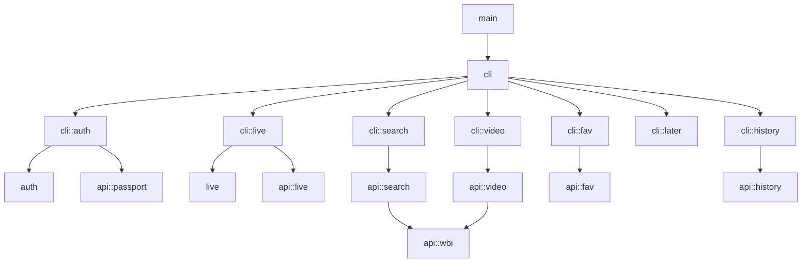

# bili-tools (`bt`)

B站终端多功能工具箱，提供开播下播、账号管理、视频检索、个人数据（收藏夹/历史/稍后再看）等丰富命令行功能。

## 安装

### Cargo (通用)

```bash
# 首次需安装 Rust 工具链
curl --proto '=https' --tlsv1.2 -sSf https://sh.rustup.rs | sh

# 克隆并编译安装
git clone https://github.com/QwerProg/bili-tools.git --depth=1
cd bili-tools
cargo install --path .
```

编译安装到 `~/.cargo/bin/bt`，确认该目录在 PATH 中即可。

### macOS (Homebrew)

```bash
brew install QwerProg/bili-tools/bt
```

### Arch Linux (AUR)

```bash
# 使用 yay
yay -S bili-tools-bin

# 或使用 paru
paru -S bili-tools-bin
```

### Windows

#### Winget
```bash
winget install QwerProg.bt
```

#### Scoop

```powershell
# 安装 Scoop
Set-ExecutionPolicy -ExecutionPolicy RemoteSigned -Scope CurrentUser
Invoke-RestMethod -Uri https://get.scoop.sh | Invoke-Expression

# 添加 bucket
scoop bucket add QwerProg https://github.com/QwerProg/bili-tools

# 安装
scoop install bt

# 日后升级
scoop update bt
```

#### 手动下载
从 [Releases](https://github.com/QwerProg/bili-tools/releases) 下载 `bt-x86_64-windows.zip`，解压后即可运行。

## 快速使用

```bash
# 账号管理
bt auth login                  # 扫码登录
bt auth status                 # 查看登录状态、UID、硬币、会员到期等
bt auth logout                 # 退出登录并清除凭证

# 直播模块
bt live start                  # 交互式开播
bt live start -a 398 -t "标题" # 指定分区与标题直接开播
bt live stop                   # 立即下播
bt live stop -d 30m            # 30分钟后下播（Ctrl+C 取消）
bt live status                 # 查看直播状态
bt live following              # 查看已关注主播的开播情况
bt live title "新标题"         # 查看或修改直播标题
bt live area -k "游戏"         # 搜索或切换直播分区

# 搜索发现
bt search hot                  # 查看实时热搜榜
bt search video "Rust"         # 搜索视频（WBI 签名加密鉴权）
bt search user "老番茄"        # 搜索 UP 主
bt search live "自习室"        # 搜索直播间

# 视频互动
bt video info BV1hp4y1k7SV     # 查看视频详情（播放/弹幕/分P列表）
bt video like BV1hp4y1k7SV     # 点赞
bt video coin BV1hp4y1k7SV     # 投币
bt video triple BV1hp4y1k7SV   # 一键三连

# 个人数据
bt fav list                    # 列出所有收藏夹
bt fav show <收藏夹ID>         # 查看指定收藏夹内容
bt fav export <ID> --format csv# 导出收藏夹（支持 csv/json/text）
bt later list                  # 查看稍后再看列表
bt later add BV1hp4y1k7SV      # 添加到稍后再看
bt history list --limit 10     # 查看最近观看历史

# 通用选项
bt --json search hot           # 机器可读 JSON 输出（支持所有查询子命令）
bt -q live status              # 静默模式

# Shell 补全
bt completions zsh --install   # 自动安装 Tab 自动补全
```

### 命令架构

```
Usage: bt [OPTIONS] <COMMAND>

Commands:
  auth         账号与认证管理 (login, status, logout, refresh)
  live         直播间管理与开播 (start, stop, status, title, area, following)
  search       内容与用户搜索 (video, user, live, hot)
  video        视频操作 (info, like, coin, triple)
  fav          收藏夹管理 (list, show, export)
  later        稍后再看管理 (list, add, clear)
  history      观看历史记录 (list)
  completions  生成 shell 自动补全脚本 (bash, zsh, fish)

Options:
      --json   以 JSON 格式输出结果
  -q, --quiet  静默模式，不输出提示信息
  -h, --help   显示帮助
  -V, --version 显示版本号
```

## 交互流程

```
# 首次使用 — 扫码登录
✔ 选择一种登录方式 · 扫码登录（Web，推荐）
· 开始B站二维码登录流程...
[终端弹出二维码]
✅ 二维码已保存到 qrcode.png
· 等待用户处理...

# 登录后 — 正常开播
bt start
✅ 登录状态正常
✔ 是否使用上次直播的分区？ · yes
✅ 使用上次的分区: 自习室 - 372
✔ 请输入新标题（回车保留原标题） · 晚上随便播会儿

🎬 直播已开启
  推流地址  rtmp://live-push.bilivideo.com/live-bvc/
  推流码    ?strea************...g=13
  ·  推流信息已写入 ~/.config/bt/stream_info.txt

# 已在播时运行 — 询问下播
bt start
· 检测到当前正在直播中
✔ 检测到当前正在直播中，是否关闭？ · yes
· 准备关闭直播...
🎬 直播已关闭
  统计
  新增粉丝  3
  弹幕数量  42
  直播时长  7200
  最大在线  18
  累计观看  156
  粉丝勋章  2
  金仓鼠    0

# 查看状态 — 显示 B 站电视机 Logo
bt status
```

### 登录方式

默认使用 Web 扫码登录；菜单保留 TV 扫码作为备用，也支持短信、账号密码和浏览器链接登录。扫码等待约 3 分钟后超时，二维码过期时请重新登录。所有 HTTP 请求设置 30 秒超时。

Linux/macOS 上，数据目录权限为 `0700`，Cookie 和推流信息文件为 `0600`；访问数据目录时会收紧旧版本文件的权限。凭据采用临时文件写入后替换，避免写入中断损坏原文件。

开播成功后的推流文件或统计标识保存失败、下播成功后的统计查询失败，均单独显示警告，不会将已完成的开播/下播报告为失败。

## 分区选择

使用上下箭头选择分区大类，Enter 确认后选择子分区。

## 技术栈

| 类别 | 依赖 |
|---|---|
| CLI 解析 | `clap 4`（derive 宏） |
| HTTP 请求 | `minreq`；Web 登录轮询使用 `ureq` 保留多条 Cookie 响应头（rustls TLS） |
| 序列化 | `serde` + `serde_json` |
| 终端 UI | `dialoguer` |
| 二维码 | `qrcode` + `image` |
| 日志 | `log` + `env_logger` |
| 时间 | `chrono` |
| 错误处理 | `thiserror` |
| Rust 版本 | Edition 2024 |

## 架构



```
src/
├── main.rs               # 主程序入口与初始化
├── cli/                  # CLI 子命令定义与终端交互
│   ├── args.rs           # Clap 命令行定义 (多级子命令)
│   ├── output.rs         # 全局 --json / --quiet 状态控制
│   ├── auth.rs           # bt auth 命令实现
│   ├── live.rs           # bt live 命令实现 (开播/下播/状态/关注)
│   ├── search.rs         # bt search 命令实现 (视频/用户/直播/热搜)
│   ├── video.rs          # bt video 命令实现 (详情/点赞/投币/三连)
│   ├── fav.rs            # bt fav 命令实现 (列表/详情/导出)
│   ├── later.rs          # bt later 命令实现 (稍后再看)
│   ├── history.rs        # bt history 命令实现 (历史记录)
│   └── completions.rs    # bt completions Shell 补全
├── api/                  # 官方接口请求封装
│   ├── wbi.rs            # WBI 鉴权加密与密钥缓存
│   ├── client.rs         # 通用 HTTP 请求头配置
│   ├── passport.rs       # 登录、Token刷新、用户信息、退出登录
│   ├── live.rs           # 直播状态、开下播、分区、关注状态
│   ├── search.rs         # 综合/视频/用户/直播搜索与热搜
│   ├── video.rs          # 视频详情、点赞、投币、三连
│   ├── fav.rs            # 收藏夹列表、明细与全量资源分页
│   └── history.rs        # 观看历史与稍后再看列表
├── auth/                 # 凭据管理与持久化
│   ├── cookies.rs        # cookies.json 读写管理 (0600权限、buvid指纹)
│   ├── login.rs          # 登录流程 (扫码/短信/密码)
│   └── session.rs        # 登录态验证与保证
├── live/                 # 直播核心业务
│   ├── manager.rs        # 开播推流码获取、写入 stream_info.txt 与下播
│   └── stats.rs          # 下播统计数据拉取
├── ui/                   # 终端 UI 渲染
│   ├── area_selector.rs  # dialoguer 两级分区选择器
│   └── prompts.rs        # 输出高亮宏
└── utils/                # 工具函数 (二维码渲染/推流码脱敏/路径)
```

### 模块说明

| 模块路径 | 主要职责与核心逻辑 |
| :--- | :--- |
| **`cli/`** | 统一管理 CLI 参数分发。各个子模块专注于自身的人机交互、美化表格排版与 `--json` 格式化。 |
| **`api/wbi.rs`** | 完整实现 B 站官方 WBI 签名算法，提供每日密钥轮询缓存与特殊字符转义大写，确保搜索和详情接口稳定通过风控。 |
| **`auth/`** | 凭证仓库。`cookies.rs` 保存完整 Cookie 集合（`DedeUserID`、`SESSDATA`、`bili_jct`、`buvid3/4`、`refresh_token` 等），并自动以 `0600` 权限落地文件。 |
| **`live/`** | 直播全生命周期。涵盖交互/非交互开播、推流码安全打码、延迟下播倒计时、下播统计数据展示与关注主播实时开播列表。 |
| **`api/`** | 对 B 站官方接口的无状态 HTTP 请求层，支持分页递归、自动参数签名与响应结构体反序列化。 |

## 构建与发布

CI 由 GitHub Actions 驱动，推送 `v*` tag 时自动执行多平台交叉编译与发布：

1. **Windows** (`windows-latest`)：构建 `x86_64` (x64) 与 `aarch64` (ARM64) 二进制，并分别打包为 `bt-x86_64-windows.zip` 和 `bt-arm64-windows.zip`。
2. **macOS** (`macos-latest`)：构建 `x86_64` (Intel) 与 `aarch64` (Apple Silicon) 二进制，分别打包为 `bt-x86_64-macos.zip` 和 `bt-arm64-macos.zip`。
3. **Linux** (`ubuntu-latest`)：构建 `x86_64` 与 `aarch64` 二进制，分别打包为 `bt-x86_64-linux.tar.gz` 和 `bt-arm64-linux.tar.gz`。
4. **统一发布**：六个平台构建成功后，使用 `docs/releases/v版本号.md` 发布说明生成 Release，上传完整 SHA256SUMS。
5. **包管理器更新**：运行同步脚本后推送 Scoop、Homebrew、AUR 清单，并向 `microsoft/winget-pkgs` 提交更新 PR。

Release 构建参数已做极限体积优化，并静态链接 MSVC 运行时，**无需额外安装 VC++ Redistributable**：

```toml
[profile.release]
codegen-units = 1
lto = "fat"
opt-level = "z"   # 体积优先
panic = "abort"
strip = "symbols"
```

### 版本号更新

版本号以 `Cargo.toml` 为准，同步脚本会自动更新所有包管理器清单：

```bash
# 1. 修改 Cargo.toml 中的 version
# 2. 运行同步脚本
./scripts/sync-version.sh --checksums /path/to/SHA256SUMS
```

该脚本根据发布包的 SHA256SUMS，同步更新 Scoop（含 bucket 入口）、Homebrew、WinGet 和 AUR 二进制包的版本、下载地址和校验和。必须先完成发布包构建。

## 设计亮点

- **同步请求**：常规接口使用 `minreq`，Web 登录轮询使用 `ureq` 完整读取多条 `Set-Cookie`，无需异步运行时
- **体积优化**：激进的 Release 配置使产出二进制尽可能小，适合直接分发单文件
- **跨平台分发**：Scoop、Winget、AUR、Homebrew、Cargo 均有支持
- **推流码安全**：默认打码（`prefix****...suffix`），`--show` 才显示完整推流码
- **非交互式友好**：`bt start --area ... --title ...` 组合可完全跳过交互，便于脚本调用

## 注意事项

- `cookies.json` 包含敏感凭证（SESSDATA、bili_jct），存储在系统数据目录（macOS/Linux: `~/.config/bt/`，Windows: `%APPDATA%/bt/`），请勿泄露或提交到版本控制
- 推流信息写入 `stream_info.txt`（同数据目录），第一行 RTMP 地址，第二行完整推流码
- 高频调用接口可能触发风控，请合理使用
- 本项目仅供学习交流，禁止用于违反 B 站用户协议的行为
